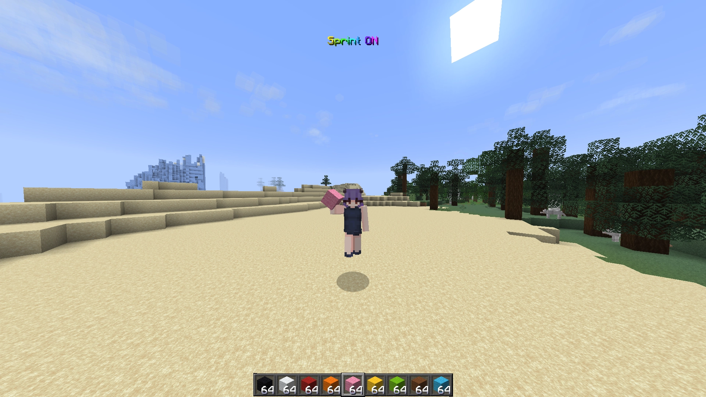

# Mitra's Auto Sprinter

Press **K** (or a key you choose) to toggle auto-sprint on or off. When you can't sprint, the HUD shows why.

Also fixes [MC-263293](https://bugs.mojang.com/browse/MC/issues/MC-263293), where the game forgets your sprint toggle after dying or changing worlds.

## Features

- Auto-sprint: hold `W` and you run automatically.
- Toggle key: default is `K`, rebindable in Controls.
- HUD states:
    - **Sprint ON** (green): sprinting.
    - **Sprint OFF** (gray): auto-sprint disabled.
    - **Sprint OFF (*reason*)** (yellow): auto-sprint is enabled but something is blocking it (hunger, sneaking, wall, etc.), with the reason shown.
- Two display modes: text, or the speed-effect icon.
- Animated text colors: solid, rainbow (whole label cycles), or chroma (per-letter wave).
- Positioning: presets (top/bottom, left/center/right) or drag-to-place with the built-in editor.
- Show/hide rules: always on screen, only when blocked, or only briefly on change.
- HUD text, colors, and blocked-reason messages are configurable.
- Client-side only: completely safe for multiplayer.
- *Tiny footprint: only ~1000 lines of Java code

## Requirements

- [Fabric Loader](https://fabricmc.net/)
- [Fabric API](https://modrinth.com/mod/fabric-api)
- [Fzzy Config](https://modrinth.com/mod/fzzy-config)
- [Mod Menu](https://modrinth.com/mod/modmenu) optional but is recommended for access to the config screen.

Supported Minecraft versions are listed on the [Modrinth page](https://modrinth.com/mod/mitras-auto-sprinter) and the [GitHub releases](https://github.com/Mitra-88/Mitras-Auto-Sprinter).

## Usage

1. Put the `.jar` file in your `mods` folder.
2. Launch the game and join a world or server.
3. Press **K** (or your custom toggle key).
4. Hold `W` to sprint automatically.

Press **K** again to turn it off. The setting persists between sessions but starts off the first time you play.

Keybindings: **Options → Controls → Mitra's Auto Sprinter**.

## HUD reference

- **Sprint ON** (green): running.
- **Sprint OFF** (gray): mod disabled.
- **Sprint OFF (*reason*)** (yellow): enabled but blocked. Possible reasons: *Not Moving*, *Restricted*, *In Vehicle*, *Too Hungry*, *Shallow Water*, *Using Item*, *Flying* (elytra), *Sneaking*, *Crawling*, *Hit Wall*.
- **Joining...** / **Loading terrain...** (gray): shown briefly after joining or teleporting, until the world is ready.

Icon mode replaces the text with the speed-effect icon, bright when sprinting and faded when not.

Default position is top-center, below the boss bar. This can be changed.

## Moving and resizing the HUD

1. Set a key for the HUD editor in **Controls** (unbound by default), or use the *Open HUD Editor* button in the config screen.
2. Press that key in-game to open the editor.
3. Drag the HUD box to a new position.
4. Press **ESC** to save.

In the editor:

- Hover over the HUD and press **R** to reset its position.
- In Icon mode, resize with the mouse wheel or `+`/`-` (numpad works too).
- **Arrow keys** nudge the HUD by 1 pixel; **Shift+Arrows** move in bigger steps (10, or the grid size when grid snapping is on).
- **Double-click** the HUD to center it horizontally.
- While dragging, the HUD snaps to the screen edges, the horizontal and vertical center lines, the default top position, and the safe area above the bottom HUD. Snapping aligns what you see (the background box counts when it's enabled), and a magenta guide line appears while snapped.
- Press **G** to toggle grid snapping — an 8-pixel grid, drawn faintly with brighter lines every 32 pixels.
- Hold **Ctrl** while dragging to move freely without snapping (nudging with the arrow keys is always snap-free).
- The HUD's exact position (in GUI pixels) is shown above it while dragging.

## Configuration

The keybind and editor cover most use cases, but further settings are available via **Mod Menu → Mitra's Auto Sprinter → Configure**:

- **Sprint**: master on/off switch.
- **HUD**: visibility, background box, display mode (Text/Icon), show mode (Always/Blocked only/On change), position, text shadow, icon scale, text color mode (Solid/Rainbow/Chroma), and colors for ON/OFF/Blocked states plus background. Solid colors and the color mode itself only apply in Text mode.
- **Labels**: text for *Sprint ON*, *Sprint OFF*, *Joining...*, *Loading terrain...*, and the blocked-message format (`%s` marks where the reason goes).
- **Blocked Reasons**: text for each of the 10 blocking reasons.

## Server use

The mod holds the sprint key for you, equivalent to taping the key down or using the vanilla toggle-sprint option.

All vanilla sprint restrictions still apply: sneaking, eating, elytra flight, shallow water, etc. all stop sprinting as normal, and hitting a wall stops it too.

## Links

- [Download on Modrinth](https://modrinth.com/mod/mitras-auto-sprinter)
- [Source code on GitHub](https://github.com/Mitra-88/Mitras-Auto-Sprinter)

## License

CC0 1.0. Do whatever you want with it. A shoutout is appreciated though (❁´◡`❁).

See the [LICENSE](LICENSE) file for the full text.
