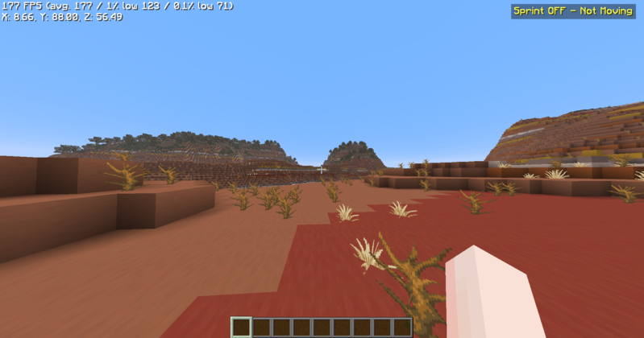

# Mitra's Auto Sprinter

**TL;DR: Press `K`, hold `W`, sprint forever.** Something stopping you from sprinting? The HUD tells you what. And since the mod literally just holds your sprint key down, it's safe on servers. That's the whole mod.

## Why?

I made this because I couldn't find an auto sprint mod I trusted, and I wanted an indicator that tells me why I'm not sprinting so my brain could finally stop overthinking it.

## Features

- 🏃 Sprint automatically whenever you move forward
- ⌨️ Toggle it with `K` (rebindable, obviously)
- 📊 A little HUD that shows if you're sprinting and *why not* when you aren't
- 🖱️ Drag the HUD anywhere on screen with a built-in editor
- 🎨 Change the HUD text and colors
- 💻 Client-side only
- ⚡ Tiny and lightweight

## What you need

Fabric Loader + Fabric API. For the supported Minecraft versions, check the [Modrinth page](https://modrinth.com/mod/mitras-auto-sprinter) or the [latest release on GitHub](https://github.com/Mitra-88/Mitras-Auto-Sprinter) both always show the current one.

## How to use

1. Drop the jar in your `mods` folder
2. Join a world or server
3. Press **K**

Now hold `W` and run. Press **K** again to turn it off.

The mod remembers your choice between restarts, but it starts *off* the first time you play so if nothing happens at first, just press K. Don't panic.

Keybinds live in the usual spot: **Options → Controls → Mitra's Auto Sprinter**.

### The HUD

While you play, a small indicator shows what's going on:

- **Sprint ON** (green) - you're running
- **Sprint OFF - Too Hungry** (yellow) - you *would* be sprinting, but something's in the way. It tells you what: *Hit Wall*, *Using Item*, *Blindness*, and so on. All the normal vanilla stuff.
- **Sprint OFF** (gray) - the mod is off

### Moving the HUD

Don't like where it sits? Fair.

1. In **Options → Controls → Mitra's Auto Sprinter**, set a key for **Open HUD Editor** (it's unbound by default)
2. Press it in game
3. Drag the HUD wherever you want - it can't go off-screen (hopefully lol)
4. Press **ESC** to save

Done.

## Is this safe on servers?

Yep. The mod literally just holds your sprint key down for you - the same as taping the key to your keyboard or using vanilla's toggle-sprint option. All of Minecraft's normal sprint rules still apply, so it won't sprint while you're sneaking, eating, elytra flying, or anything else vanilla says no to. Run into a wall? Sprint stops, exactly like normal.

Nothing is faked and nothing weird gets sent to the server, so there's nothing for anti-cheats to flag.

## Config (optional)

You never *have* to touch this - the keybind and HUD editor cover everything you normally need. But if you like tinkering, everything lives in `config/mitrasautosprinter.properties`. It shows up after your first toggle, and you should only edit it **while the game is closed** (otherwise your changes get overwritten).

- `sprintEnabled` - whether the mod starts on or off
- `hudVisible` / `hudBackground` - hide the HUD or its background box
- `hudX` / `hudY` - HUD position (or just use the editor)
- `hudColorOn` / `hudColorBlocked` / `hudColorOff` / `hudBackgroundColor` - the colors
- `textOn` / `textOff` / `textBlockedFormat` - the HUD text (`%s` gets replaced with the reason)
- `reasonHungry`, `reasonBlind`, etc. - rename each "why not" message

**Colors are just normal hex codes** - like `#55FF55`. Grab one from any color picker website, paste it in, done. Genuinely as simple as that.

## Links

- 📥 [Download on Modrinth](https://modrinth.com/mod/mitras-auto-sprinter)
- 💻 [Source code on GitHub](https://github.com/Mitra-88/Mitras-Auto-Sprinter)

## License

CC0 1.0. Do whatever you want with it. See [`LICENSE`](LICENSE) for the full license text.
