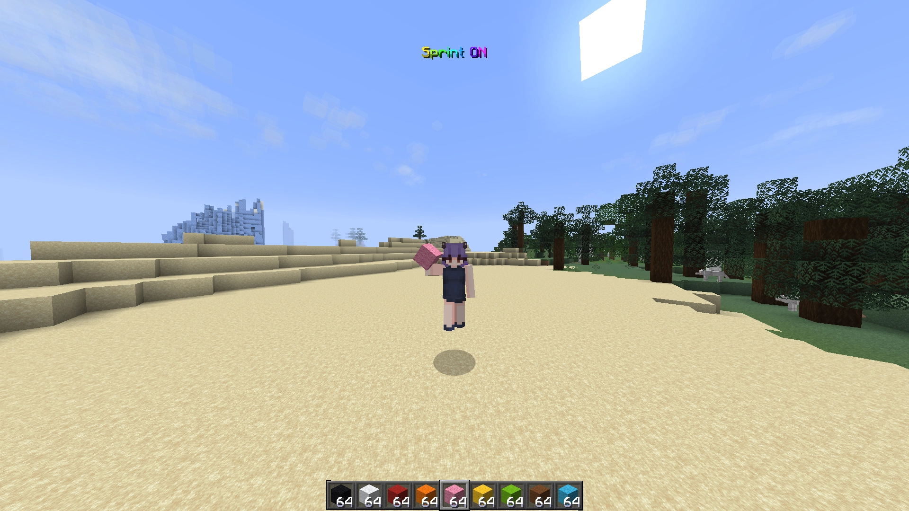

# Mitra's Auto Sprinter

Auto-sprint that holds the sprint key for you, with a HUD that tells you why you can't sprint. 100% client-side and multiplayer-safe, and it fixes [MC-263293](https://bugs.mojang.com/browse/MC/issues/MC-263293), where the game forgets your sprint toggle after dying or changing worlds. Made with Hypixel Skyblock in mind, but it works anywhere, singleplayer and servers alike.

Press **K** to turn it on or off. While it's on, you sprint automatically whenever you hold `W`. If something blocks the sprint, the HUD shows the reason. Your setting is remembered between sessions.

Full setup, HUD reference, editor controls, and every setting: see the [Guide](GUIDE.md).

## Supported versions

Built for Minecraft **26.2** on Fabric. The full list of supported Minecraft versions and downloads lives on the [Modrinth page](https://modrinth.com/mod/mitras-auto-sprinter); GitHub releases sometimes lag behind.

## Links

- [Download on Modrinth](https://modrinth.com/mod/mitras-auto-sprinter)
- [Source code on GitHub](https://github.com/Mitra-88/Mitras-Auto-Sprinter)

## License

CC0 1.0. Do whatever you want with it. A shoutout is appreciated though (❁´◡`❁). See the [LICENSE](LICENSE) file for the full text.
